# Features and Usage Walkthrough

-   [Features and Usage Walkthrough](#features-and-usage-walkthrough)
    -   [What is SchedViz?](#what-is-schedviz)
    -   [Collections Page](#collections-page)
    -   [Load a collection by name](#load-a-collection-by-name)
    -   [Load an existing collection](#load-an-existing-collection)
    -   [Trace View](#trace-view)
    -   [Collection Information Bar](#collection-information-bar)
    -   [Metrics Pane](#metrics-pane)
        -   [Threads Tab](#threads-tab)
        -   [Events Tab](#events-tab)
        -   [Layers Tab](#layers-tab)
    -   [Heatmap Pane](#heatmap-pane)
        -   [Heatmap](#heatmap)
        -   [Zoombrush and Metrics](#zoombrush-and-metrics)
    -   [Sharing](#sharing)

## What is SchedViz?

SchedViz collections are traces of kernel scheduling events. Over the requested
trace duration, each time certain scheduling phenomena, such as thread switches,
migrations, and wakeups, occur on the target, a record of that event is logged
to a buffer. When the requested trace duration is up, that buffer is stored in
the cloud. Then, when a collection is opened, its trace buffer is fetched,
processed to extract the intervals during which threads were running, waiting,
or sleeping on each CPU, and these intervals visualized in the SchedViz UI.

Under the hood, SchedViz uses Ftrace for tracing.

## Collections Page

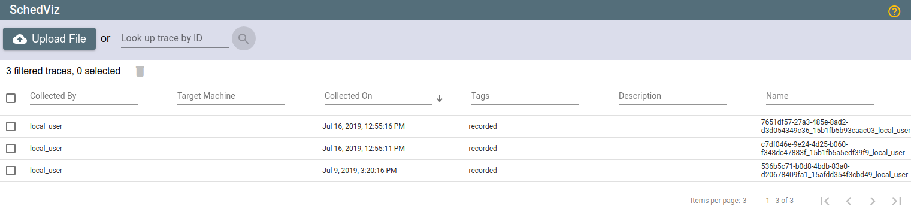

The SchedViz **Collections Page** is used to collect new SchedViz profiles as
well as load and manage existing SchedViz
profiles.

### Load a collection by name

If you have a collection unique ID, you can paste it into this text field and
press the gray search glass (🔍) button to open it.

>TIP: The URL of a SchedViz UI currently showing a collection can be copied-and-
pasted to share that collection.

### Load an existing collection

Load and manage SchedViz collections from the `Collection List`. This list shows
all of your collections, initially sorted by recency (most recent first.) For
each collection, it shows the target machine, collection date and time, and any
tags or description you've applied to the collection. Click on a collection to
open it in SchedViz.

Clicking on a collection's checkbox selects that collection; all selected
collections can be deleted in one go with the delete icon at the top of the
collection list.

You can filter the set of collections you see, based on target machine,
description, tags, or unique ID, or any substring thereof, by entering text in
the filter boxes in the header row.

To sort the set of collections by a column, hover over the column's header and
click the arrow that appears. Clicking again will change the sort order between
ascending and descending.

>TIP: Edit a collection's description and tags to make it easier to find specific
collections later. The description and tags are also used when filtering the
collection list, so good descriptions and tags can help you find particular
collections.

## Trace View

[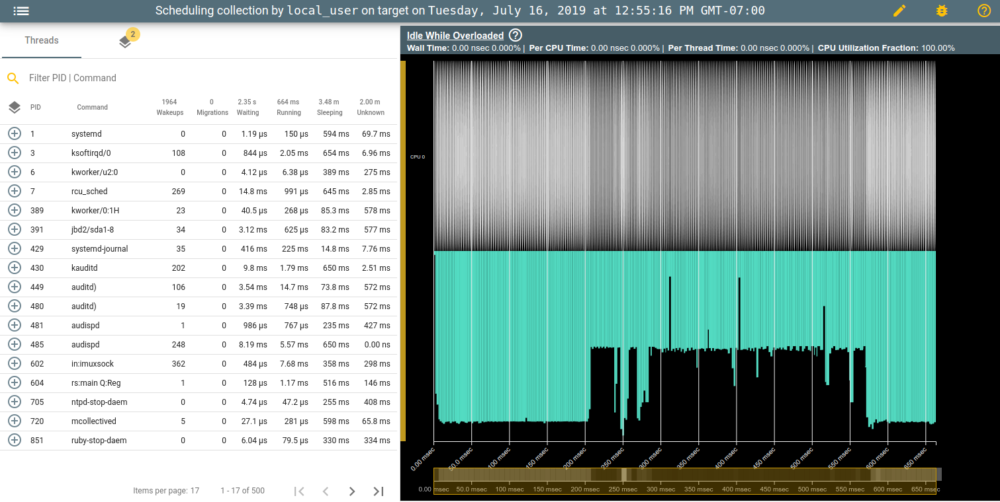](images/walkthrough/trace_view.png)

When a collection is opened, its trace view is presented. This is the primary
view for interacting with a single trace. At the top of the trace view, details
about the current collection are presented in the **Collection Information
Bar**. Below the **Collection Information Bar**, the **Metrics Pane** on the
left provides multiple views of trace metrics (organized by thread, by thread
event, etc.) and provides a point of entry for creating (and managing)
**SchedViz layers**. The **Heatmap Pane** on the right displays behavior over
time, and renders custom layers.

Layers can be created for a single thread (via the **Threads Tab** in the
**Metrics Pane**), a given event type (via the **Event List Tab**), or for the
results of a query (within the **Threads Tab**). Layers can be reordered,
hidden, removed, and recolored via the **Layers Tab**. By default, collections
are loaded with two layers: One showing running thread metrics for all CPUs, and
one showing waiting thread queues for periods of CPU runtime.

Our investigative flow typically involves:

1.  Create layers for some threads, tasks, and/or event types of interest (e.g.
    typing 'VCPU' into the Command query box and clicking the "Create Layer for
    Query" button on the right).
2.  Identifying an interesting set of CPUs (i.e., the CPUs they ran on, or the
    CPUs they *could* run on).
3.  Filtering to those CPUs (via links in the CPU axes or via the CPU filter
    input in the Layers tab), and viewing threads that preempted / blocked the
    threads of interest.

Details below.

 <!-- Spacing to force the next header under the above image -->

### Collection Information Bar

The Collection Information Bar shows details about the current trace, and
controls for sharing the current view (with all filtering, layers, zooming, etc.
applied), editing collection owners, tags, and description. Additionally, there
is a button for reporting bugs. The menu logo, when clicked, returns to the
landing page.

>TIP: Most performance issues require some zooming, filtering, selecting, and
other manipulation to really become obvious. At low zoom levels, visual 'hot
spots' in the Heatmap Pane provide guidance for smaller areas to potentially
investigate.

### Metrics Pane

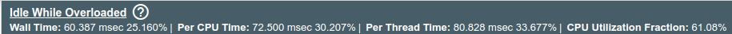

The **Metrics Pane** hosts several tabs, containing various information and
settings:

*   **Threads Tab**: Lists all currently filtered-in threads.
*   **Events Tab**: Lists all trace event types present in this collection and
    supports creation of layers for a given event type.
*   **Layers Tab**: Shows list of user-created layers with hide/show toggles,
    remove button, color control, and a drag handle for adjusting render order.
    Additionally, controls for global render settings allow users to adjust the
    heatmap's targeted level-of-detail (i.e. the upper bound for the number of
    intervals drawn in the viewport at any given time, where a higher bound can
    impact render performance) and adjust which layer intervals are drawn by
    default. The tab also contains a control for filtering which CPUs are
    visible in the heatmap.

#### Threads Tab

The **Thread Tab** hosts a **Thread List**, with a **Filter Input** and a
**Header Row** at top. The **Filter Input** supports filtering by PID or command
name. You can create a layer from a filter query by clicking the + (layer icon)
button on the right of the **Filter Input**. Query results can also be inverted
(and "inverse" layers can be created) by tapping the search icon left of the
query input box. The **Header Row** can sort threads by any field. To sort by a
field, click the arrow (appears on mouseover) next to the field name. Clicking
again will change the sort order between ascending and descending.

Each item in the **Thread List** represents a unique PID (here, PID is the
thread ID or TID, not parent process ID \[PPID\] or thread group ID \[TGID\]) on
the target, with metrics about its behavior over the filtered-in duration and
CPU set, and with its command name. This latter is the OS's name for that
thread.

>TIP: The **Thread List** will also filter with the **Heatmap** viewport, as you
zoom and pan.

Hovering the mouse cursor over a thread shows a preview in the heatmap of which
CPUs that thread was active on. A thread may be expanded or collapsed by
clicking on the thread row; this opens (or closes, if already opened) a thread
detail pane at the bottom of the Thread List. An expanded thread shows a list of
its scheduling tracepoint events, and a list of its antagonists.

The event list shows the tracepoint events that pertain to the expanded thread.
Hovering the mouse cursor over an event renders crosshairs in the heatmap at
that event.

The antagonist list shows the expanded thread's *antagonists*: other threads
that ran on a CPU while the expanded thread was waiting (not sleeping) on that
same CPU in the currently-filtered-in view. Antagonism information is
particularly useful to identify causes of work-stealing, and to identify
significant amounts of round-robin waiting. Clicking on the plus creates a layer
for that antagonist thread, therein marking all antagonists with the same PID as
'selected'.

>TIP: Two threads being mutually antagonistic, particularly if the durations of
their mutual antagonisms are similar, is a strong indication of round-robin
waiting.

#### Events Tab

Clicking the '+' button for a given trace event type will create a layer for all
instances of that event (Note: for large collections, at low zoom levels, these
layers will be exceptionally dense).

[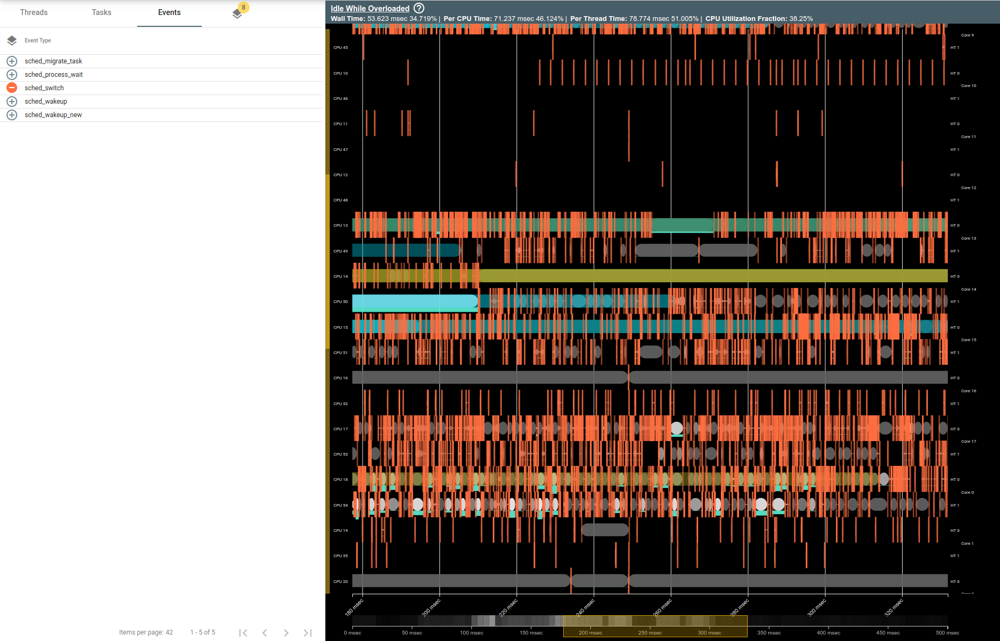](images/walkthrough/events_tab.png)

#### Layers Tab

The **Layers Tab** provides advanced render settings that affect the
**Heatmap**.

[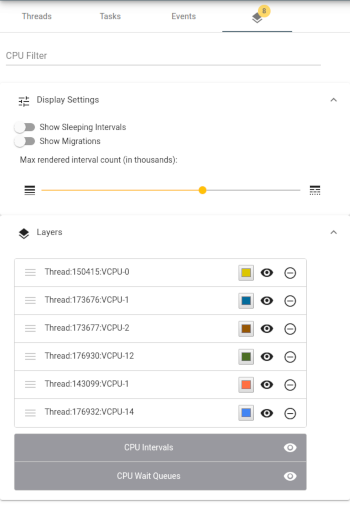](images/walkthrough/layers_tab.png)

The **Layers Tab** contains a CPU Filter input where sets of CPUs can be
specified by comma-separated lists or hyphen-connected ranges (e.g. `5` or
`30-40`). CPUs are designated here by their CPU number (the left-hand y-axis
labeling), not by attributes of their topology.

The **Detail Factor** slider permits you to adjust the tradeoff between visual
precision and UI performance. More detail, and reduced UI performance, is to the
right.

> WARNING: It's best to reduce the size of the viewport, by CPU- filtering
> and/or zooming, before enabling this, especially for large or complex traces.

The **Show Sleeping Intervals** toggle controls whether sleeping thread states
are rendered in the **Heatmap**.

The **Show Migrations** toggle controls whether migrations should automatically
be drawn between relevant thread states, for all layers.

The **Layers List** component shows each layer in render order with its unique
name and assigned color (which can be edited on click). The visibility toggle
will hide the layer temporarily from view, and the remove icon will delete it
entirely. Layer render order can be adjusted using the drag handler on the left.

[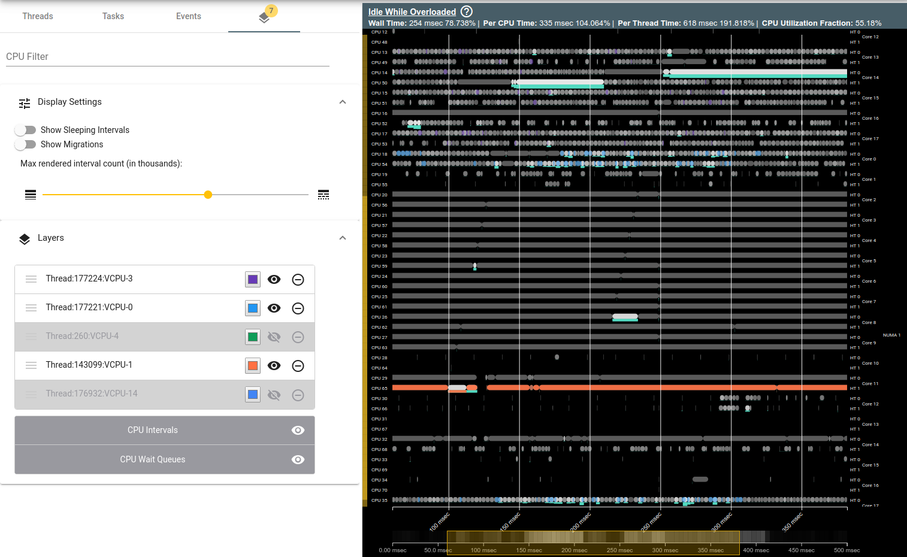](images/walkthrough/manipulated_layers.png)

### Heatmap Pane

The **Heatmap Pane** displays a **Heatmap Options** bar at top, a **Zoom Brush**
showing the current viewport **Metrics** at the bottom, and a **Heatmap** in
between.

#### Heatmap

The **Heatmap** is a multi-dimensional chart, with time as the x-axis, CPUs as
the y-axis, and various other metrics encoded into cell heights, intensities,
and opacities. The chart comprises horizontal swim-lanes, one per CPU, with
rendered intervals, the intensities of which indicate how busy or idle the CPU
was and how many threads were waiting on that CPU.

[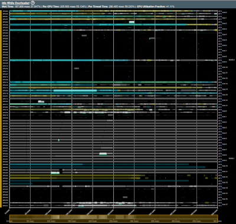](images/walkthrough/unzoomed_heatmap.png)
[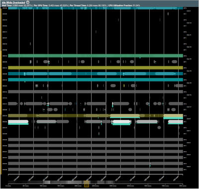](images/walkthrough/zoomed_heatmap.png)

(left: Unzoomed **Heatmap**. right: Zoomed-in **Heatmap**)

The **Heatmap** supports zooming and panning. Scrolling up within the pane zooms
the x-axis in centered around the cursor, scrolling down does the opposite.
Holding down `shift` while scrolling also zooms in or out along the y-axis.
Clicking and dragging pans the visible viewport, which is shown as the yellow
rectangle in the **Zoom Brush**.

**CPU Swimlane**

[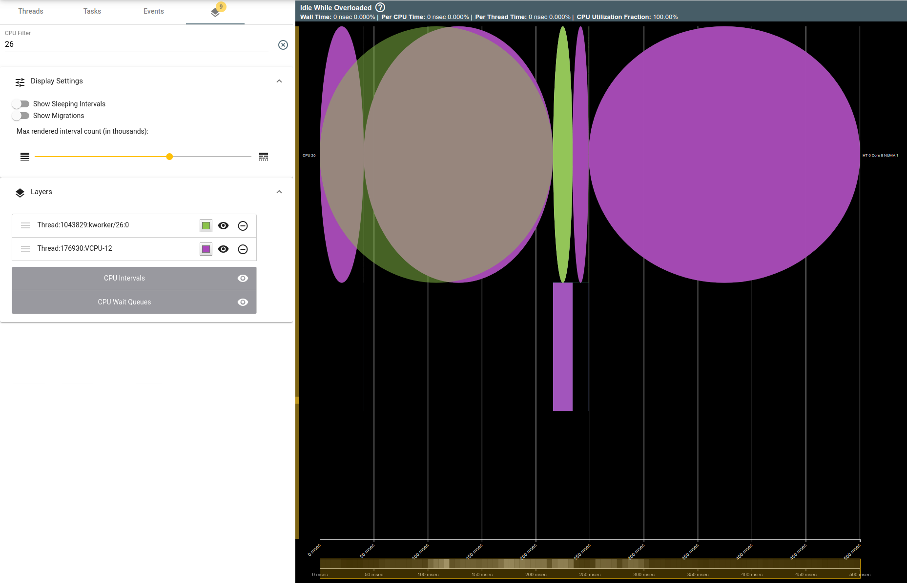](images/walkthrough/cpu_swimlane.png)

Each CPU swim-lane is divided vertically into two parts. The top part shows the
CPU's intervals drawn in greyscale, with the intervals of any selected threads
superimposed over it. The height of a greyscale CPU interval indicates how much
of that time it spent doing useful work (that is, not idling), and the shade of
the interval indicates how full its wait queue was -- the brighter, the fuller.

The wait queue is more explicitly presented in the bottom part of the swim-lane,
where a teal stripe shows the length of the wait queue -- the thicker the
stripe, the more full the wait queue. Selected threads are also colored in this
stripe.

To improve rendering performance, the greyscale CPU intervals may be *merged*.
Adjacent intervals with different properties -- running threads, waiting
threads, and proportion idle -- merge to produce an interval the width of both
merged components, whose waiting thread set is the union of both components and
whose proportion idle is the weighted average of both components. Note that this
can yield a nonintegral waiting thread count; for merged CPU intervals, the set
of waiting threads is those that waited *for any time during the interval*, not
those that waited *for the entire interval*.

We do not attempt to merge the running threads if they're different. If you need
to determine the running threads in a merged interval, you may:

*   Zoom in horizontally until the merged interval breaks apart,
*   Zoom in vertically, or filter down to a particular CPU by clicking on its
    y-axis label. To filter subset of CPUs, rather than just one, input a CPU
    filter string in the CPU Filter text box at the top of the **Layers Tab**.
    As fewer CPUs' swim-lanes are rendered, the merging threshold is reduced,
    and level of detail shown increased.
*   Reduce the **Detail Factor** in the **Settings Tab** to manually reduce the
    merging threshold. Note that this may wedge your browser if done on too much
    data!

>TIP: Round-robin waiting produces a very distinctive pattern in the **Heatmap**,
with threads alternating running and waiting with a fixed period (the scheduling
interval.)

> [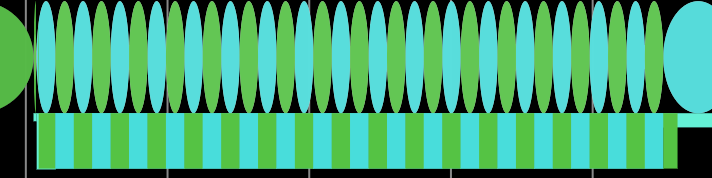](images/walkthrough/round_robin.png)

Clicking any greyscale CPU interval with a single running thread selects that
thread. Clicking a teal wait queue selects all threads waiting over that time.

Toggling the `Show Sleep` control in the **Layers Tab** renders selected
threads' sleeping states as semi-trasparent, outlined intervals.

[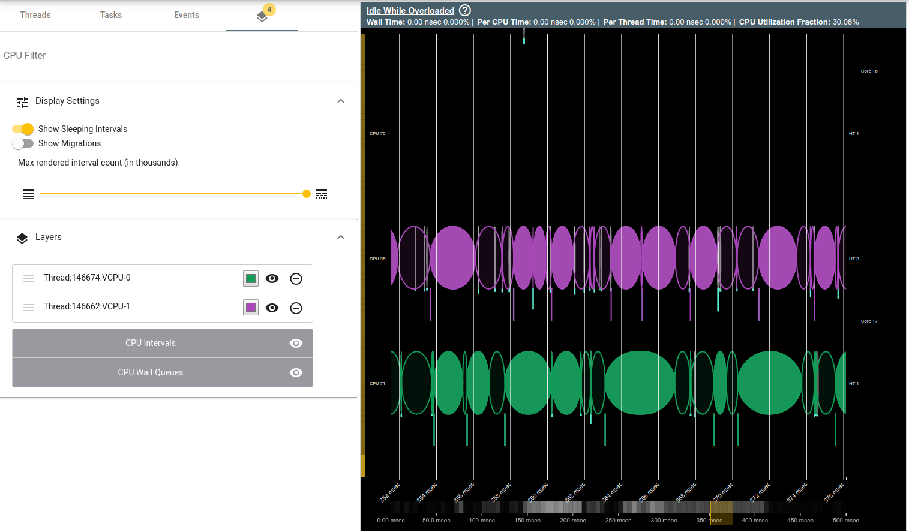](images/walkthrough/sleep_time.png)

Likewise, toggling the `Show Migrations` control in the **Layers Tab** will
render CPU migrations for all thread layers.

[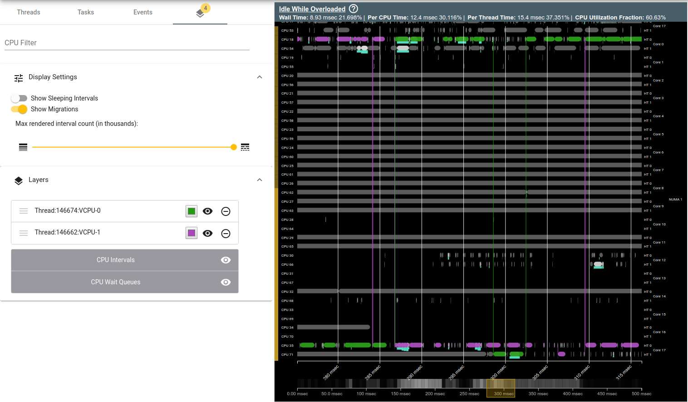](images/walkthrough/migrations_selected.png)

>TIP: Enabling `Thread Migrations` and `Show Sleep` is best done once you've
already zoomed in a bit, filtered-in some CPUs, and selected a few threads.
Enabling them for the entire trace with many threads selected yields a very
messy, hard-to-follow view, and can severely degrade browser performance.

#### Zoombrush and Metrics

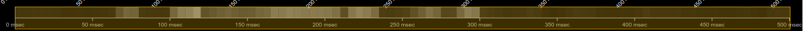

At the bottom of the **Heatmap Pane** is the **Zoom Brush**, which indicates the
current zoom level in x (time), and can be used to quickly narrow down to a
desired time range. The **Zoom Brush** background represents and aggregate, 1D
heatmap, for all CPUs. At the top of the pan is a header showing a set of
**Metrics** for the visible interval. These describe the CPU utilization and
overall balance of the currently-visible portion of the trace. Four metrics are
shown:

*   The **Wall Time** metric shows the accumulated time during which any CPU was
    idle while another CPU was overloaded;
*   The **Per-CPU Time** metric shows the total time, aggregated across all idle
    CPUs, for which there was some other overloaded CPU;
*   The **Per-Thread Time** metric shows the total amount of work, in CPU-
    seconds, that could have been accomplished if waiting threads had been moved
    to idle CPUs in the current view. Note that system policies such as CPU-set
    affinity may have precluded such moves.
*   The **CPU Utilization** metric shows the proportion of not-idle CPU-time in
    the current view.

For example, if two CPUs were overloaded for one second, one with one waiting
thread and the other with two waiting threads, and four other CPUs were idle for
that same second, the **Wall Time** for that interval would be one second (At
least one CPU was idle while another was overloaded for the entire second); the
**Per-CPU Time** would be two seconds (two CPUs were overloaded while at least
two others were idle); and the **Per-Thread Time** would be three seconds (three
threads were waiting while at least three CPUs were idle.) If, however, only two
CPUs were idle during that second, Per-CPU Time would remain the same while
Per-Thread Time would only be two seconds, because while three threads were
waiting over that second, only two CPUs were idle.

If only one CPU is currently filtered in, **Wall Time**, **Per-CPU Time**, and
**Per-Thread Time** will all be 0s, and **CPU Utilization** will show the
average utilization of that CPU over the currently-visible time interval.

You can bring up this description of these metrics within the tool by clicking
the `(?)` button.

## Sharing

As noted elsewhere, SchedViz URLs may be shared. When viewing a collection, the
URL contains hashed UI state to replicate the current view.

It is also possible to apply some filters by more explicit URL hashing that can
be manually or programmatically generated. These filtering options include:

*   Selected PIDs. Add `pids=<comma-separated PID list>` to the URL after the
    hash. Any invalid PIDs or PIDs that don't parse as integers are ignored.
*   Filtered CPUs. Add `cpus=<comma-separated CPUs or CPU ranges>` to the URL
    after the hash. CPU ranges are specified, as in the CPU filter box in the
    UI, by two CPU numbers separated by hyphens. Multiple `cpus` keys may be
    applied, and all will be combined. Invalid input is treated as it is in the
    CPU filter box.
*   Zoom range. Add `start_timestamp=<start timestamp>` and/or
    `end_timestamp=<end timestamp>` to the URL after the hash. Timestamps are
    specified as integers and interpreted as nanoseconds from start of the
    collection. If either tag is invalid, such as not parsing as an integer, the
    collection start and end times will be used instead.

Note that, once loaded in a browser, these tags will be removed and replaced
with the usual share link, though the filters they specify will be applied.

If any of these filtering tags is used with a shared SchedViz URL, the shared
state will be discarded in favor of this filtering.
